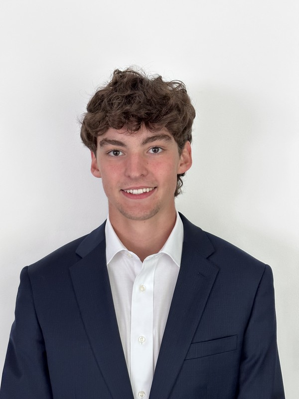

# Bennett Speicher

**Baltimore, MD**

[bdspeicher@gmail.com](mailto:bdspeicher@gmail.com) | [LinkedIn](https://www.linkedin.com/in/bennettspeicher/) | [GitHub](https://github.com/bdspeicher12)

---

## Summary

Data Science master's candidate (MPS, UMBC — December 2026) with a finance background from Emory University. Across multiple internships with Red Alpha's Data Tradecraft & AI team, I have built AI-driven document tools in Python — spanning OCR extraction, automated document generation, and document corpus querying applications.

---

## Education

**University of Maryland, Baltimore County (UMBC)**
Master of Professional Studies in Data Science — *December 2026*

**Emory University — Goizueta Business School**
Bachelor of Business Administration, Concentration in Finance — *May 2025*

---

## Technical Skills

| Languages | Tools | Techniques |
| --- | --- | --- |
| Python; TypeScript (working knowledge) | OpenAI API; Git/GitHub; Jupyter; pandas; scikit-learn | OCR; NLP; LLM integration; Retrieval-Augmented Generation (RAG); document automation |

---

## Professional Experience

### Red Alpha LLC — Data Science Intern, Data Tradecraft & AI Team
*June 2026 – Present*

- Currently developing a Python tool that ingests documents and lets users query them as a searchable corpus.

### Red Alpha LLC — Data Science Intern, Data Tradecraft & AI Team
*June 2025 – August 2025*

- Engineered a document processing and generation tool in Python leveraging OpenAI large language models to automate parsing and drafting of documents.
- Integrated LLM APIs into an end-to-end pipeline that ingested source documents and produced structured written output.
- Collaborated with the team to design and refine processing logic for accuracy and reliability.

### Red Alpha LLC — Data Science Intern, Data Tradecraft & AI Team
*May 2024 – August 2024*

- Built an optical character recognition (OCR) extraction tool using Python and TypeScript to automate capture of text from document images.
- Developed and tested extraction pipelines converting unstructured scanned documents into structured, machine-readable output.
- Integrated the tool into existing document workflows alongside the team.

---

## Additional Experience

### GBMC Hospital — Volunteer
*May 2023 – August 2023*

- Supported and transported 50+ patients under anesthesia alongside nurses and doctors within the endoscopy center.
- Oversaw 15+ patient areas within the infusion center, ensuring timely meal delivery and proper treatment planning.
- Accompanied patients recovering from chemotherapy and upper endoscopy surgery, promoting a positive hospital experience.
- Supported administration of care by updating nurses and doctors on 30+ patients' current treatment plans.
- Worked and shadowed alongside doctors during an endoscopy surgery to better understand treatment plans.

---

## Collegiate Athletics

- **Varsity Baseball** — University of Maryland, Baltimore County (NCAA Division I)
- **Varsity Baseball** — Emory University (NCAA Division III)
