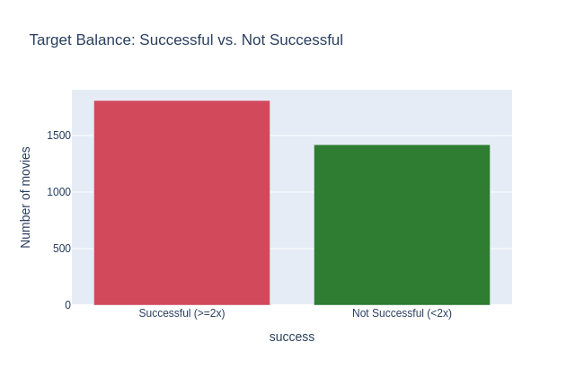
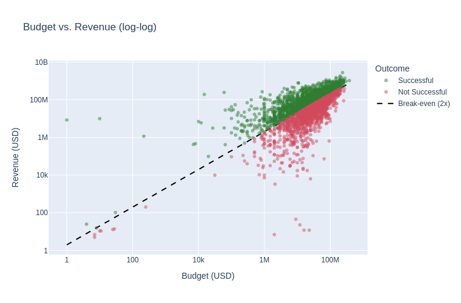
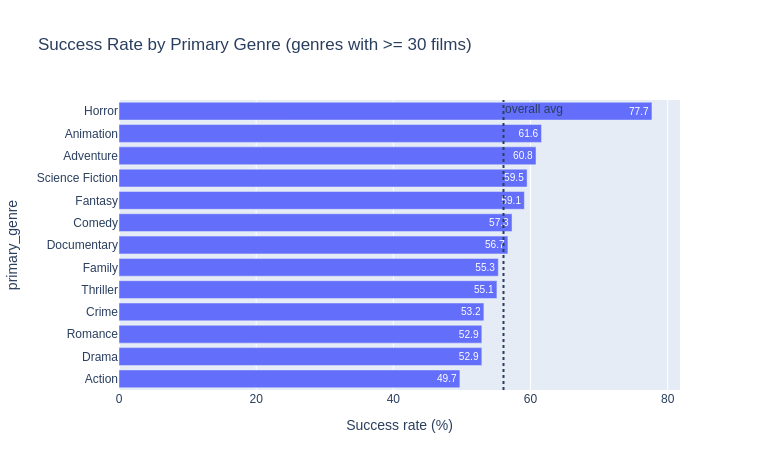
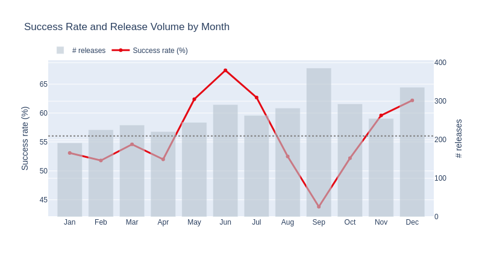
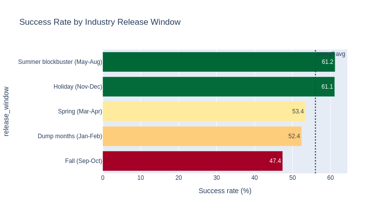
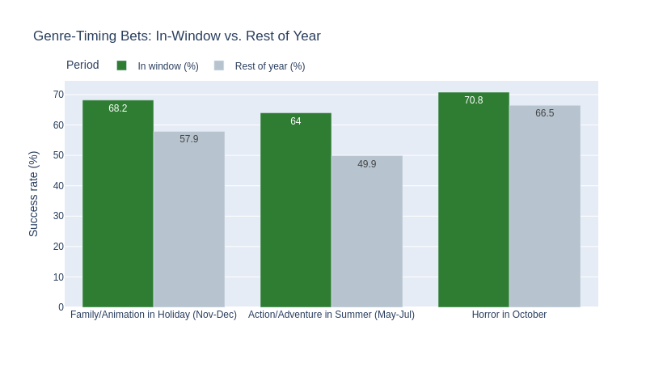
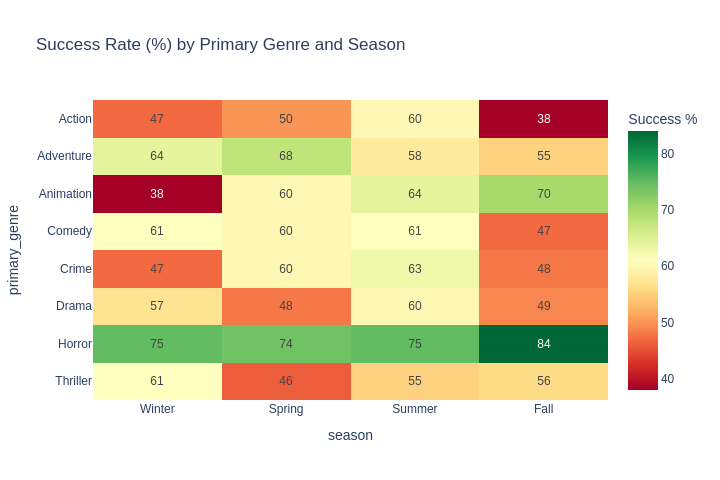

# Predicting Movie Box-Office Success Before Release

*This document is the evolving project report. It began as the proposal (Sections 1–3) and now includes the completed exploratory data analysis (Section 4). Model training, the application, and conclusions will be added in later sections.*

## 1. Title and Author

- **Project Title:** Predicting Movie Box-Office Success Before Release
- Prepared for UMBC Data Science Master Degree Capstone by Dr. Chaojie (Jay) Wang
- **Author:** Bennett Speicher
- **GitHub Repository:** https://github.com/bdspeicher12/UMBC-DATA606-Capstone
- **LinkedIn:** https://www.linkedin.com/in/bennettspeicher/
- **PowerPoint Presentation:** *to be added (final deliverable)*
- **YouTube Video:** *to be added (final deliverable)*

---

## 2. Background

Producing and releasing a film is an enormous financial bet. A studio commits tens or hundreds of millions of dollars to a production years before a single ticket is sold, and most of that decision is made on incomplete information. While many factors that determine a film's fate — word of mouth, reviews, competing releases — only emerge *after* launch, a number of meaningful signals are known **before release**: the production budget, genre, runtime, planned release timing, original language, and the production companies involved.

This project builds a machine-learning model that predicts whether a movie will be a **financial success** using only information available *before* the film is released. The goal is a decision-support tool: given a film's pre-release profile, estimate the probability that it will earn back enough at the box office to be profitable.

### Why it matters

- **Investment risk.** Greenlighting a film is a high-stakes capital-allocation decision. A model that estimates the financial odds of a project — from attributes a studio controls or knows early — supports smarter budgeting and portfolio choices.
- **Release strategy.** Studios spend heavily deciding *when* to release a film. Quantifying how much the release window matters, and for which genres, is directly actionable.
- **An honest framing.** Rather than predicting raw revenue (which is dominated by a handful of blockbusters and easy to over-fit), this project predicts a **budget-relative** outcome that reflects what studios actually care about: did the movie make money?

### Defining "success"

A movie is labeled a **success** if its worldwide box-office **revenue is at least twice its production budget** (`revenue ≥ 2 × budget`). This 2× rule is a widely used industry proxy for theatrical break-even, for two reasons:

1. **Marketing roughly doubles the cost.** Studios typically spend an additional ~50–100% of the production budget on prints and advertising (P&A).
2. **Theaters keep about half the gross.** Exhibitors retain roughly 50% of box-office ticket sales, so the studio nets only about half of the reported revenue.

Together these mean a film must gross roughly twice its production budget to break even. *Caveat:* the dataset's `revenue` is worldwide box-office gross and `budget` excludes marketing, so this label is a well-grounded **proxy** for profitability rather than exact accounting profit — a limitation acknowledged throughout the project.

### Research questions

1. Can a film's **financial success** (revenue ≥ 2× budget) be predicted from **pre-release** attributes alone?
2. Which pre-release factors — budget, genre, runtime, release timing, language, number of production companies — most influence the odds of success?
3. **Does release timing matter?** Are films released in the summer and holiday windows more likely to succeed, and is early fall really a weak "dump" period?
4. **Do genre and timing interact?** For example, do horror films do better around Halloween, family films over the holidays, and action/adventure in summer?
5. How accurately can common classification models distinguish successes from non-successes, and which performs best?

---

## 3. Data

### Data source

- **TMDB 5000 Movie Dataset** — movie metadata from The Movie Database (TMDb), a widely used public film dataset originally released for the Kaggle "TMDB Box Office Prediction" project.
- File used: `data/tmdb_5000_movies.csv`
- Source/origin: The Movie Database (TMDb) via Kaggle.

### Data size and shape

| Property | Value |
| --- | --- |
| File size | ~5.7 MB |
| Raw rows (movies) | 4,803 |
| Raw columns | 20 |
| Usable rows after cleaning | 3,228 (≈67%) |
| Time period | Release years **1916–2016** |

**What each row represents:** one **movie**.

### Data dictionary (original columns)

| Column | Type | Definition | Example / values |
| --- | --- | --- | --- |
| `budget` | int | Production budget (USD) | 237,000,000 |
| `genres` | JSON | List of genre tags | Action, Adventure, Fantasy |
| `homepage` | string | Official film URL (sparse, ~64% missing) | http://… |
| `id` | int | TMDB movie ID | 19995 |
| `keywords` | JSON | Plot keyword tags | "culture clash", "future" |
| `original_language` | string | ISO 639-1 language code | en, fr, ja |
| `original_title` | string | Title in original language | Avatar |
| `overview` | string | Short plot synopsis | free text |
| `popularity` | float | TMDB popularity score *(post-release)* | 150.4 |
| `production_companies` | JSON | Companies that produced the film | Ingenious Film Partners |
| `production_countries` | JSON | Countries of production | United States of America |
| `release_date` | date | Theatrical release date | 2009-12-10 |
| `revenue` | int | Worldwide box-office gross (USD) | 2,787,965,087 |
| `runtime` | float | Length in minutes | 162 |
| `spoken_languages` | JSON | Languages spoken in the film | English, Spanish |
| `status` | string | Release status | Released, Post Production, Rumored |
| `tagline` | string | Marketing tagline (sparse, ~18% missing) | "Enter the World of Pandora." |
| `title` | string | English title | Avatar |
| `vote_average` | float | Mean user rating, 0–10 *(post-release)* | 7.2 |
| `vote_count` | int | Number of user votes *(post-release)* | 11,800 |

### Engineered features

| Feature | Type | Definition |
| --- | --- | --- |
| `roi` | float | revenue ÷ budget |
| `profit` | int | revenue − budget |
| `year`, `month` | int | Parsed from `release_date` |
| `season` | category | Winter / Spring / Summer / Fall (from month) |
| `release_window` | category | Summer (May–Aug) / Holiday (Nov–Dec) / Spring (Mar–Apr) / Dump (Jan–Feb) / Fall (Sep–Oct) |
| `primary_genre` | category | First listed genre |
| `n_genres` | int | Number of genres listed |
| `n_production_companies` | int | Number of production companies |
| `n_spoken_languages` | int | Number of spoken languages |
| `is_english` | binary | 1 if original language is English |
| `is_summer_action_adv` | binary | Action/Adventure released May–Jul |
| `is_october_horror` | binary | Horror released in October |
| `is_holiday_family` | binary | Family/Animation released Nov–Dec |
| **`success`** | binary | **Target:** 1 if `revenue ≥ 2 × budget`, else 0 |

### Target variable

**`success`** — binary label; class balance ~56% successful / ~44% not, which is well balanced for classification.

### Candidate features (predictors)

Only **pre-release** attributes are used as predictors — variables that would actually be known before a film opens: `budget`, `primary_genre` (and genre indicators), `runtime`, `month` / `season` / `release_window`, `original_language` / `is_english`, `n_production_companies`, `n_spoken_languages`, and the genre-timing flags above.

**Explicitly excluded (data leakage):** `revenue`, `roi`, `profit`, `popularity`, `vote_average`, and `vote_count` are all **post-release** outcomes and are *not* used as predictors, since they would not be available at the time a prediction is needed.

---

## 4. Exploratory Data Analysis (EDA)

The full analysis, with code and commentary, is in [`../notebooks/eda.ipynb`](../notebooks/eda.ipynb). This section summarizes the data preparation and the main findings.

### 4.1 Data cleaning and preparation

Starting from 4,803 raw movies, the following steps produce a clean, tidy, model-ready dataset:

1. **Keep released films only** (`status == "Released"`).
2. **Drop rows with unknown budget or revenue.** In TMDB a value of `0` encodes "unknown." Because our target and ROI are budget-relative, these rows would be misleading, so we require `budget > 0` **and** `revenue > 0`.
3. **Require a release date** (needed for the timing analysis) and remove duplicate title/date rows.
4. **Parse JSON columns** (`genres`, `production_companies`, `spoken_languages`) into usable values.
5. **Engineer features** — financial (`roi`, `profit`, `success`), timing (`year`, `month`, `season`, `release_window`), counts, and the genre-timing flags.

After cleaning, **3,228 movies (≈67% of the raw data)** remain, spanning **1916–2016**. Sparse columns (`homepage`, `tagline`) are dropped. Each row is one movie, each column one property — a tidy dataset.

### 4.2 The target variable

Under the 2× definition the target is nearly balanced — **56.0% successes (1,809)** vs. **44.0% non-successes (1,419)**. This balance means accuracy is a meaningful metric and the model won't be biased toward a majority class.

### 4.3 Budget, revenue, and genre

Budget and revenue are heavily right-skewed (a few blockbusters dominate), so they are examined on log scales. Plotting budget against revenue and marking the 2× break-even line shows the core relationship: bigger budgets earn more in absolute terms, but **many high-budget films still fall below break-even** (red points above large budgets). Budget is informative but far from deterministic — which is exactly why the problem is worth modeling.

Success rate also varies by **genre**. Horror, Animation, and Adventure clear the 2× bar most often, while Drama lags the overall average.

### 4.4 Release timing and seasonality

Release timing is a clear source of signal. The chart below overlays the **success rate** (line) with the **number of releases** (bars) for each month. Success peaks in **June (67%)** and stays high across summer and December, and collapses in **September (44%)** — which, notably, is also one of the highest-volume months, consistent with the industry's early-fall "dump" period.

Grouped into industry release windows, the pattern is unmistakable (overall baseline ≈ 56%):

| Release window | Success rate | Median ROI |
| --- | --- | --- |
| Summer blockbuster (May–Aug) | **61.2%** | 2.62 |
| Holiday (Nov–Dec) | **61.1%** | 2.64 |
| Spring (Mar–Apr) | 53.4% | 2.13 |
| Dump months (Jan–Feb) | 52.4% | 2.10 |
| Fall (Sep–Oct) | **47.4%** | 1.89 |

### 4.5 Genre × timing interactions

The timing effect is strongest for *specific genres in specific windows* — exactly the pattern suggested during the proposal review:

| Genre-timing bet | In window | Rest of year | Lift |
| --- | --- | --- | --- |
| Action/Adventure in Summer (May–Jul) | **64.0%** | 49.9% | **+14 pp** |
| Family/Animation in Holiday (Nov–Dec) | **68.2%** | 57.9% | **+10 pp** |
| Horror in October | 70.8% | 66.5% | +4 pp |

Two notes on horror specifically: it is a standout genre overall (**67% success**, thanks to low budgets and high ROI), and **October is its single biggest release month** — studios clearly cluster horror around Halloween even though the per-film success lift is modest. The genre × season heatmap below shows how success shifts across the calendar for each genre (e.g., Action is weakest in Fall at 38%, while Animation is strongest in Fall at 70%).

### 4.6 Key takeaways for modeling

- **Balanced target** (~56%) — good footing for classification.
- **Budget** matters but is not deterministic; **genre** and especially **release timing** add real, independent signal.
- **Timing features** (`season`, `release_window`) and **genre-timing flags** are promising engineered predictors and will be included in the model.
- **Leakage is controlled** — all post-release fields (revenue, ROI, popularity, ratings) are excluded from the predictor set.

---

## 5–8. (To be completed in later assignments)

Model training and evaluation, the Streamlit web application, conclusions, and references will be added in subsequent assignments.
